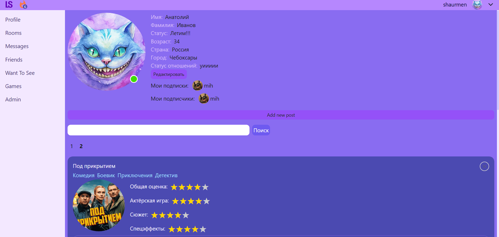
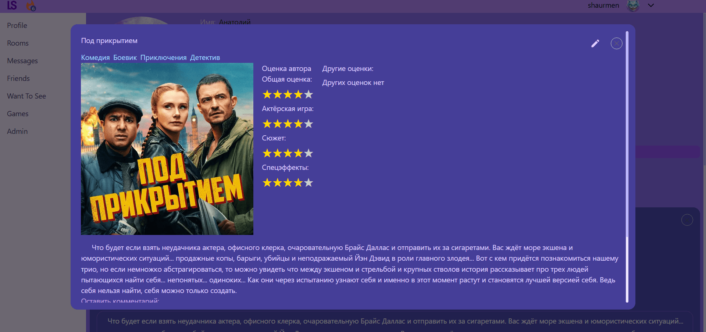
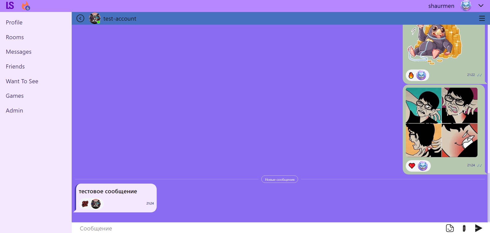
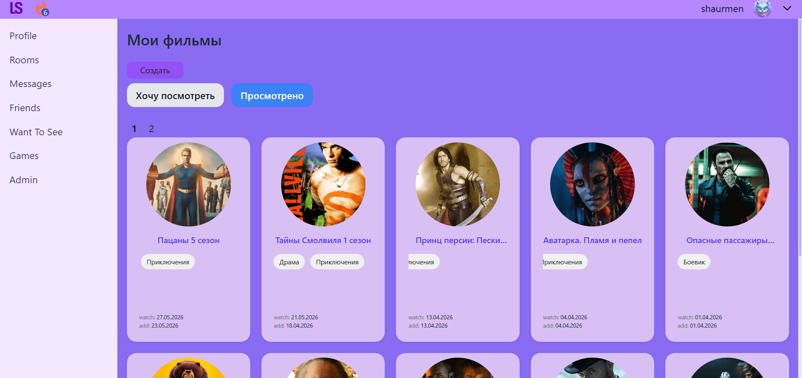

# LikeSocial

Социальная сеть для обсуждения фильмов и сериалов. Позволяет создавать посты с детальными оценками, общаться в приватных группах и смотреть контент вместе с друзьями в реальном времени.

## Ошибка подключения

В случае если при попытке подключиться к сайту произошла ошибка. Попробуйте включить VPN и попробовать снова. Одна из возможных причин ошибки РКН блокирует зарубежные сервера.

## Основные возможности

- Посты с оценками по конкретным параметрам (актерская игра, спецэффекты и т.д.) по шкале от 0 до 5 звезд.
- Разные типы постов: фильм, сериал, летсплей или обычный текстовый пост.
- Голосования и комментарии к постам.
- Приватные группы для общения с друзьями.
- Полноценный чат с поддержкой текста, картинок, стикеров и реакций.
- Аудио и видеозвонки.
- Раздел "Хочу посмотреть" для сохранения черновиков будущих постов.
- Совместный просмотр фильмов (Watch Party) с синхронизацией и голосовым чатом.

## Стек технологий для клиентской части

- Next.js (App Router)
- TypeScript
- SCSS
- npm
- Redux Toolkit (Thunk)
- Socket.IO
- Axios
- JWT, Access / Refresh токены
- REST API

## Демонстрация интерфейса

**Главная страница и оценки**

**Посты**

<!-- **Совместный просмотр (Watch Party)**
 -->

**Чат**

**Раздел "Хочу посмотреть"**

